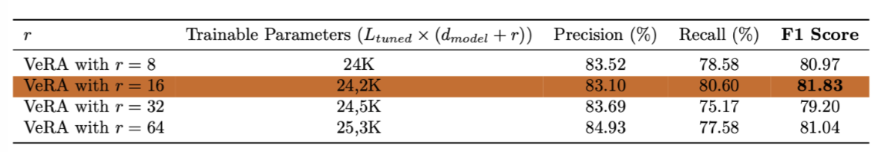

# Efficient-Fine-Tuning-Techniques-for-Deep-Learning-Models

## Overview

This repo aims to explore efficient fine-tuning techniques for deep learning models, focusing on reducing the computational and environmental costs associated with training large-scale models. We emphasize methods like Low-Rank Adaptation (LoRA), VeRA, and Quantization, which aim to enhance the fine-tuning process for foundational models.

## Project Description

Training deep learning models typically requires significant memory and sophisticated infrastructure. As models become increasingly parametrized — for instance, GPT-3 contains approximately 175 billion parameters — the challenge of efficiently training and adapting these models to new tasks grows. Traditional fine-tuning approaches, which re-train all model weights for each new task, are not only resource-intensive but also impractical in terms of storage and computational power requirements.

### LoRA: Low-Rank Adaptation

Introduced in 2021 ([LoRA: Low-Rank Adaptation of Large Language Models](https://arxiv.org/pdf/2106.09685v2.pdf)) by Edward J. Hu and al., LoRA presents a method that requires training only a fraction of a model's weights. This approach significantly reduces the number of weights to train and the storage space needed, while maintaining inference time.

**Key Features of LoRA:**
- Reduces the number of trainable weights to a fraction of the total weights.
- Saves the base model once and the parallel architecture multiple times to create different models for different tasks.
- Does not increase inference time.
- Simplifies implementation and understanding.
- Applicable to any layer involving large-scale matrix products, such as transformer attention modules and linear layers.

Here is a schematic illustration of the LoRA architecture here to visually explain how LoRA adds new matrices in parallel to existing ones, and how these interact with the intrinsic low-rank structure of the model.

   
  <em>LoRA Architecture</em>

Impressive results on GPT-3 have been showcased in the original paper. We want to reproduce these results on LayoutLM for a Token Classification task on the FUNSD dataset.

### Model & Dataset

This study aims to reproduce the impressive results previously showcased for GPT-3, focusing now on LayoutLM applied to the FUNSD dataset. LayoutLM, introduced 2020 ([LayoutLM: Pre-training of Text and Layout for Document Image Understanding](https://arxiv.org/pdf/1912.13318.pdf)) by Xu and al., is a model that uniquely integrates text and layout information from scanned document images. Building on the BERT architecture, LayoutLM incorporates two novel input embeddings:

- **2D Position Embedding:** Captures the spatial position of elements in document images.
- **Image Embedding:** Enhances the linguistic representation with visual features.

We utilize the FUNSD dataset, which includes annotated samples of scanned documents. Each document is processed using the LayoutLM tokenizer available from Microsoft's repository on HuggingFace. The model used is `LayoutLMForTokenClassification`, also sourced from HuggingFace.

### Training and Evaluation

Training involves the use of a typical optimizer like AdamW with a learning rate initially set to 2e-5. We employ early stopping based on validation loss to prevent overfitting and ensure optimal performance. Each model configuration is evaluated multiple times (typically 10 to 20 runs) to generate confidence intervals for the reported metrics. 

For evaluation, we employ common metrics such as precision, recall, and F1 score, calculated across multiple test splits to ensure the robustness and reproducibility of our results.

## Performance and Results

We aim to demonstrate that with LoRA, LayoutLM can achieve or even surpass its original performance on token classification tasks while requiring fewer computational resources. Results will be presented comparing the efficiency and effectiveness of various fine-tuning techniques.

Our ablation study, as documented in the accompanying tables, provides a comprehensive view of how Low-Rank Adaptation (LoRA) can be efficiently utilized for fine-tuning models. We also evaluated the impact of varying the rank $r$ and the effect of different matrix multiplication.

   
  <em>Ablation Study</em>

This first table delves into the effect of altering the target matrices and the rank $r$. We can observe that full fine-tuning, which adjusts all model parameters, serves as our benchmark with a training parameter count of 112.818M and an F1 Score of approx. 0.674. The combination of all query, key, value, and output matrices $(W_q, W_k, W_v, W_o)$ with $84K \times r$ trainable parameters shows the most promising result. Particularly, with $r=16$, the fine-tuned model achieved an F1 Score of approx. 0.69, surpassing our full fine-tuning benchmark.

Here, we compared the performance impact of different values of $r$. The F1 Score was the highest at 0.68 ± 0.006 for $r=16$, indicating an optimal balance between efficiency and performance. Notably, increasing $r$ to 32 and 64 did not result in significant performance gains, with scores of 0.666 ± 0.017 and 0.597 ± 0.019, respectively.

  <table>
    <tr>
      <td></td>
      <td></td>
    </tr>
  </table>
  <em>Varying r and configuration types</em>

Eventually, we compared different configurations applied to LoRA fine-tuning. The `LoHaConfig` outperformed others with an F1 Score of 0.691 ± 0.001, for the best combination of $r$ and target matrices selected in the ablation study,  showcasing the potential for specific adaptations of the LoRA methodology. The other configurations, while effective, did not achieve the same level of performance as the LoHaConfig.

## Other Parameter Efficient Fine Tuning Methods

### VeRA (Vector-based Random Matrix Adaptation)

Building on the efficiencies introduced by the Low-Rank Adaptation (LoRA) algorithm, which dramatically reduces memory usage and enhances training efficiency in fine-tuning large language models, the VeRA algorithm offers further innovations. Introduced on October 2023, [VeRA: Vector-based Random Matrix Adaptation](https://arxiv.org/pdf/2310.11454) by Dawid J. Kopiczko and al. significantly streamlines the parameter tuning process. For instance, while LoRA might train between 4 million to 50 million parameters in scenarios like fine-tuning the Llama2 7B model, VeRA reduces the number of trainable parameters to a tenth of what is required by LoRA, enhancing efficiency even further. 

   
  <em>VeRA Architecture</em>

In the VeRA architecture depicted here, the typical freezing of pre-trained weights $W$ is extended to include matrices $A$ and $B$, which remain fixed and are initialized randomly. The only trainable components are the scale vectors $b$ and $d$. For the low-rank matrices $A$ and $B$, we use Kaiming initialization. As for the scale vectors, $b$ is initialized to zero and $d$ is set to a non-zero value, which is a tunable parameter. As the rank $r$ increases, the number of trainable parameters in VeRA modestly increases from $L_{tuned}$ (the number of layers tuned) at each rank elevation. The inclusion of L2 regularization with the weight_decay parameter significantly improves model performance. Fine-tuning with VeRA takes longer than LoRA due to additional vector multiplications in the forward pass. However, it requires less GPU memory.

**Comparison of Parameter Count Formulas:**

- **LoRA:** $| \Theta | = 2 \times L_{tuned} \times d_{model} \times r$
- **VeRA:** $| \Theta | = L_{tuned} \times (d_{model} + r)$

The parameter count for LoRA and VeRA highlights a fundamental difference in scalability. LoRA's parameter requirements scale multiplicatively with the model's dimension and the rank, potentially leading to higher computational costs, especially for larger models or higher ranks. In contrast, VeRA's parameter increase is additive, offering potentially better scalability for applications where maintaining a low rank suffices, thus conserving computational resources.

Below is a table displaying the VeRA model's performance across different ranks $r$, illustrating changes in trainable parameters and their effects on precision, recall, and F1 scores:

   
  <em>VeRA Results with Various Values of r</em>

This table highlights that $r = 16$ offers the best balance, achieving the highest F1 score of 81.83. It demonstrates that moderate increases in the number of trainable parameters can significantly enhance model performance, particularly in recall. Conversely, higher values of $r$ do not necessarily correlate with improved performance, as seen with $r = 32$ and $r = 64$, suggesting potential overfitting or diminishing returns on further increases in parameters.

### QLoRA (Quantized Low-Rank Adaptation)

Introduced in May 2023, [QLoRA: Efficient Finetuning of Quantized LLMs](https://arxiv.org/pdf/2305.14314) by Tim Dettmers and al., QLoRA extends the Low-Rank Adaptation (LoRA) algorithm by introducing quantization to the precision of weight parameters in pre-trained Large Language Models (LLMs). Typically, trained model parameters are stored in a 32-bit format. QLoRA, however, compresses these parameters to 4-bit precision using the NF4 data type, which is specifically designed for AI applications. This quantization significantly reduces the memory footprint, enabling fine-tuning of LLMs on single GPUs and making it feasible to run large models on less powerful hardware, including consumer-grade GPUs.

  
  <em>Comparison of QLoRA with Other Methods</em>

NF4 is optimally designed for data with a normal distribution, a common characteristic of neural network weights. This allows it to represent these weights more accurately within a constrained 4-bit format compared to the standard 4-bit float. Standard 4-bit floats, being more general-purpose, are less suited for AI applications due to their limited precision and range, which can be a significant drawback in tasks requiring high precision.

  
  <em>QLoRA Results with Various Values of r</em>

The F1 score results indicate the efficacy of each adaptation strategy in maintaining high precision and recall balances. The graph shows that as $r$ increases, QLoRA generally maintains higher F1 scores compared to LoRA in most of cases (3 out of 5). This suggests that QLoRA, despite its quantization, does not significantly compromise on the model's predictive accuracy and might even enhance it in certain configurations.

  <table>
    <tr>
      <td></td>
      <td></td>
    </tr>
  </table>
  <em>QLoRA vs LoRA: Training Time and Memory Usage</em>

The training time comparison highlights the computational efficiency of each model. LoRA generally shows lower training times compared to QLoRA, which suggests that the quantization process in QLoRA, while reducing memory usage, adds to the computational burden.

Memory usage is a crucial factor, especially in resource-constrained environments. The comparison clearly shows that QLoRA significantly reduces memory usage across all ranks compared to LoRA. This reduction is vital for deploying large models on hardware with limited memory capacity.

In summary, the choice between LoRA and QLoRA should be guided by specific application needs:
- **For accuracy**: Choose QLoRA.
- **For faster training times**: Opt for LoRA.
- **For lower memory usage**: QLoRA is the best choice.

## Key take aways

Our findings using LayoutLM model on the FUNSD dataset demonstrate LoRA and parameter efficient fine-tuning techniques in general present unique advantages for accuracy-critical applications with hardware limitations. LoRA provides a faster training experience, suitable for scenarios where training speed is a priority. This comprehensive analysis aids in making informed decisions about which model adaptation technique to deploy based on specific needs and constraints.

## References

1. [Low-Rank Adaptation of Large Language Models](https://arxiv.org/pdf/2106.09685v2.pdf)
2. [LayoutLM: Pre-training of Text and Layout for Document Image Understanding](https://arxiv.org/pdf/1912.13318.pdf)
3. [Introduction to Vector-based Random Matrix Adaptation](https://arxiv.org/pdf/2310.11454)
4. [QLoRA: Quantized Low-Rank Adaptation for Efficient Model Tuning](https://arxiv.org/pdf/2305.14314)

## Contact Information

- Nicolas Dop - nicolas.dop@student-cs.fr
- Raphaël Ferroni - raphael.romandferroni@student-cs.fr
- Amine Baccar - amine.baccar@student-cs.fr
- Marco Hakim - marco.hakim@student-cs.fr